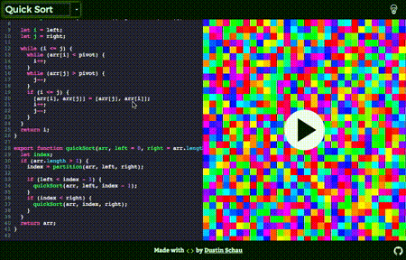

# [algorithm-playground][algorithm-playground]

  
  

A playground to experiment with different sorting algorithms and see a preview of that algorithm applied to a visulization of sorting colors

## Credits

Without the work of these excellent folks, the algorithms you see visualized would have been written by me (but not as well). I sincerely thank them for their work!

- [Sorting Algorithms in JavaScript](http://blog.benoitvallon.com/sorting-algorithms-in-javascript/sorting-algorithms-in-javascript-all-the-code/)
- [Rosetta Code](https://rosettacode.org/wiki/Sorting_algorithms/Cocktail_sort#JavaScript)
- [Learn JS With Me](http://learnjswith.me/quick-sort-in-javascript/)
- [NCZOnline](https://www.nczonline.net/blog/2009/09/08/computer-science-in-javascript-selection-sort/)

[algorithm-playground]: https://algorithm-playground.com
